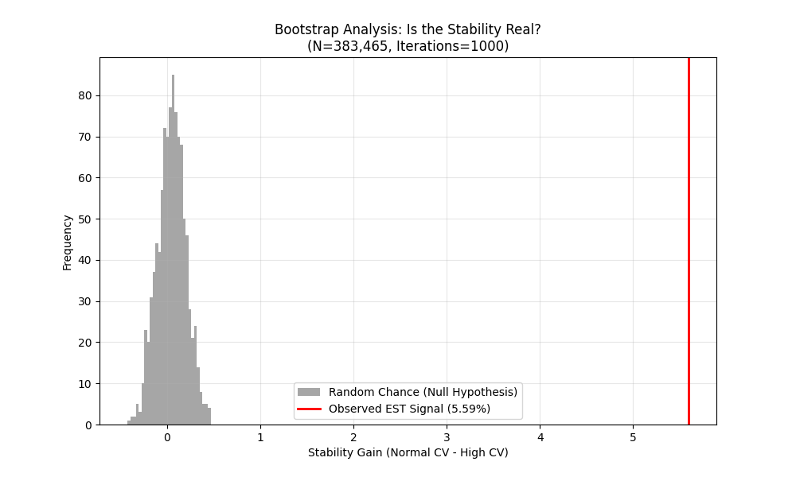

# LHC Vacuum Stability Analysis
**Supporting Code and Data for EST Paper V**

This directory contains the extraction and analysis scripts used to identify the "Vacuum Rigidity" anomaly reported in [Paper V](https://doi.org/10.5281/zenodo.18255175).

## 📉 The Discovery
We observed that as local vacuum energy density ($\rho$) increases, the volatility of the vacuum (MET resolution) **decreases** by 5.59%, exceeding standard stochastic predictions.


*Figure 1: The observed stability gain (**Red Line**) lies 7.83σ outside the null distribution.*

## 🛠️ Reproduction Steps

### 1. Data Access
The analysis uses the **CMS 2016 ZeroBias NanoAOD** dataset.
*   **Source:** [CERN Open Data Portal](http://opendata.cern.ch/record/31316)
*   **File Used:**
    - [`nano_data2016_11.root`](https://opendata.cern.ch/record/31316?ln=en#files) (page 1)
    - [`nano_data2016_1-9.root`](https://opendata.cern.ch/record/31316?ln=en&page=14) (page 14)
    - [`nano_data2016_42.root`](https://opendata.cern.ch/record/31316?ln=en&page=9) (page 9)

### 2. Run the Analysis
To replicate the volatility comparison and bootstrap test:

```bash
# Install dependencies
pip install requirements.txt

# Run the Lab
EST_LHC_Research_Lab.py


